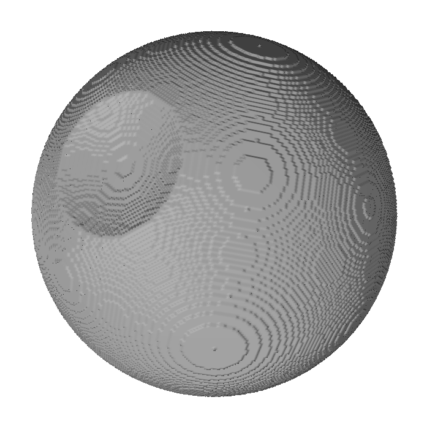

# Voxel manipulation tool

Create & manipulate 3D shapes by directly writing in-memory voxel represenations into a STL file format.

## Add/subtract/toggle 3D spheres, and export the bitmap as an STL file.

## re-compile code (a.out) with the following command (assuming clang++ is installed, and headers have not been altered)

`clang++ -Wall -std=c++11 surfaceExtraction.cpp VoxelModel.cpp main.cpp  && ./a.out`
